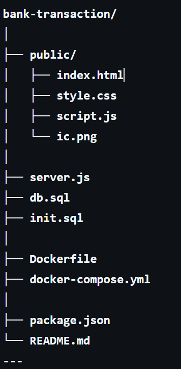

# 🏦 Bank Transfer Demo

Một ứng dụng web đơn giản mô phỏng **hệ thống chuyển tiền giữa các tài khoản ngân hàng**.

Dự án được xây dựng nhằm mục đích **minh họa cách hoạt động của Database Transaction và ACID trong DBMS**.

---

## 📌 Chức năng

- Hiển thị danh sách tài khoản
- Chọn tài khoản gửi tiền
- Chọn tài khoản nhận tiền
- Nhập số tiền cần chuyển
- Thực hiện giao dịch chuyển tiền
- Cập nhật số dư trong database

---

## 🛠 Công nghệ sử dụng

### Frontend
- HTML
- CSS
- JavaScript

### Backend
- Node.js
- Express.js

### Database
- MySQL

### Container
- Docker
- Docker Compose

---

## 📂 Cấu trúc dự án

---

## ⚙️ Cách chạy project

### 1️⃣ Clone project
git clone https://github.com/TranHuuQuyet/bank-transaction-demo

cd bank-transfer-demo

### 2️⃣ Chạy Docker
docker-compose up --build

Hệ thống sẽ khởi động:

- Node.js server
- MySQL database

---

### 3️⃣ Mở ứng dụng

Truy cập:
http://localhost:3000
