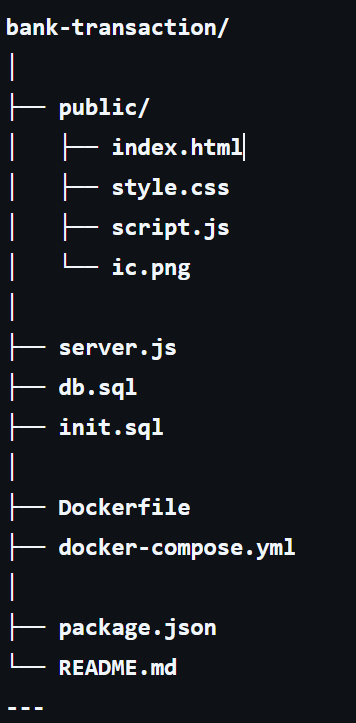

# 🏦 Bank Transfer Demo (ACID & Transaction)

Một ứng dụng web mô phỏng **hệ thống chuyển tiền giữa các tài khoản ngân hàng**.

Dự án được xây dựng nhằm mục đích **trình bày và minh họa cách hoạt động của Database Transaction và các tính chất ACID trong DBMS**.

---

# 🎯 Mục tiêu học tập

- Hiểu cách hoạt động của **Transaction**
- Minh họa 4 tính chất **ACID**:
  - **Atomicity**
  - **Consistency**
  - **Isolation**
  - **Durability**
- Quan sát các lỗi khi **không sử dụng transaction**
- Trải nghiệm các vấn đề:
  - Lost Update
  - Dirty Read (mô phỏng)
  - Non-repeatable Read
  - Race Condition

---

# 📌 Chức năng

## ✔️ Cơ bản
- Hiển thị danh sách tài khoản
- Thực hiện chuyển tiền giữa 2 tài khoản
- Lưu lịch sử giao dịch

## 🧪 Demo nâng cao

### 🔹 1. Transfer có Transaction (`/transfer`)
- Sử dụng:
  - `BEGIN`
  - `COMMIT`
  - `ROLLBACK`
- Dùng `SELECT ... FOR UPDATE` để lock dữ liệu
- Có thể:
  - simulate delay → demo blocking
  - simulate crash → demo rollback

### 🔹 2. Transfer không Transaction (`/transfer-no-tx`)
- Không dùng transaction
- Cố tình tạo lỗi:
  - ❌ Lost Update
  - ❌ Race Condition
  - ❌ Stale Data
  - ❌ Partial Update (mất tiền)

### 🔹 3. Concurrency Demo
- 2 request chạy cùng lúc
- Quan sát:
  - blocking
  - inconsistency

---

# 🛠 Công nghệ sử dụng

## Frontend
- HTML
- CSS
- JavaScript

## Backend
- Node.js
- Express.js

## Database
- MySQL

## Container
- Docker
- Docker Compose

## Test Tool
- Postman
---

## 📂 Cấu trúc dự án

---

# ⚙️ Cách chạy project

## 1️⃣ Clone project

git clone https://github.com/TranHuuQuyet/bank-transaction-demo
cd bank-transaction-demo

# 🧪 Testing bằng Postman

Phần này hướng dẫn cách test các chức năng của hệ thống bằng Postman để minh họa **Transaction và ACID**.

---

## ⚙️ Cấu hình chung

- Method: `POST`
- URL: `http://localhost:3000`
- Body: `raw` → `JSON`

---

## 🔹 Test 1 — Transfer bình thường (Success)
POST /transfer
{
  "from": 1,
  "to": 2,
  "amount": 100
}
## 🔹 Test 2 — Rollback (Atomicity)
POST /transfer
{
  "from": 1,
  "to": 2,
  "amount": 100,
  "simulateCrash": true
}
- Lỗi xảy ra giữa transaction
- Database không thay đổi (rollback)

## 🔹 Test 4 — No Transaction Bug
POST /transfer-no-tx
{
  "from": 1,
  "to": 2,
  "amount": 800
}
- Tương tự có thể test với những lỗi vi phạm ACID.
# Co thể sẽ thấy 
- âm tiền
- mất tiền
- dữ liệu sai
### Endpoint

